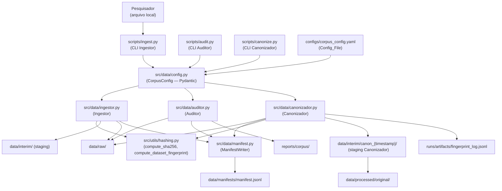
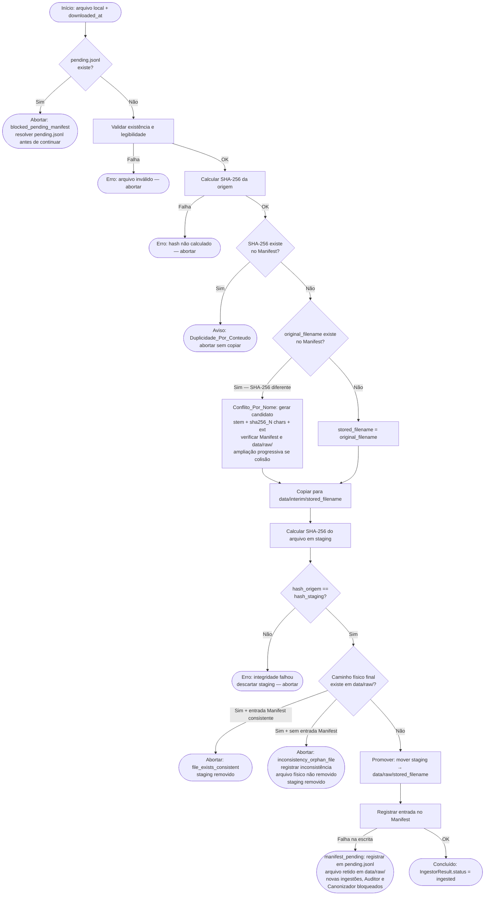

# Design Document — Construção do Corpus Piloto

## Overview

Este documento descreve o design técnico do pipeline de construção do corpus piloto de
Acórdãos públicos do TCU. O pipeline é composto por três módulos principais — Ingestor,
Auditor e Canonizador — coordenados por um arquivo de configuração central e suportados
por utilitários de hashing e persistência.

O objetivo central é garantir **rastreabilidade completa**, **imutabilidade lógica** dos
arquivos originais, **separação estrita** entre conteúdo bruto e conteúdo processado, e
**reprodutibilidade total** do processo, de forma que qualquer colaborador possa reproduzir
o corpus a partir do mesmo `Config_File` e dos mesmos arquivos de entrada.

O pipeline **não realiza download automático, web scraping ou descoberta de documentos**.
O pesquisador obtém os arquivos manualmente e os entrega ao Ingestor via linha de comando.

O corpus canônico produzido por este pipeline destina-se a experimentos de recuperação de
informação. Experimentos posteriores (busca por palavras-chave, modelos de recuperação
esparsa e densa, entre outros) consumirão o Parquet produzido aqui como entrada.

---

## Architecture

### Visão geral dos componentes



### Fluxo de dados

```
Arquivo local
    → Ingestor (validação, SHA-256, staging, verificação física, promoção)
    → data/raw/  +  data/manifests/manifest.jsonl
    → Auditor (verifica proveniência → análise estrutural e de qualidade)
    → reports/corpus/
    → Canonizador (verifica proveniência → filtragem, doc_id, Parquet → staging atômico → publicação)
    → data/processed/original/  +  sidecar JSON  +  _rejected.jsonl  +  fingerprint_log.jsonl
```

---

## Components and Interfaces

### 3.1 CorpusConfig — `src/data/config.py`

**Responsabilidade:** Modelo Pydantic v2 que valida e carrega o `Config_File`. Centraliza
todos os parâmetros de execução do pipeline, garantindo que erros de configuração sejam
detectados antes de qualquer operação de I/O.

**Dependências diretas:** `pydantic`, `pyyaml`, `tomllib` (stdlib Python ≥ 3.11).

```python
from pathlib import Path
from pydantic import BaseModel, Field

# schema_version é definido como constante no módulo
schema_version: str = "1.0"

class CorpusConfig(BaseModel):
    # --- Campos obrigatórios ---
    source_identifier: str          # ex: "TCU-portal-publico"
    batch_id: str                   # ex: "tcu-acordaos-2024-v1"
    schema_version: str             # versão do schema do Manifest; ex: "1.0"
    config_version: str             # versão desta configuração específica; ex: "1.0"
                                    # conceitualmente separado de schema_version:
                                    # schema_version versiona o contrato de campos do Manifest;
                                    # config_version versiona esta instância de configuração
    allowed_fields: list[str]       # campos elegíveis para o Corpus_Canonico
    dataset: str                    # ex: "acordaos-tcu"
    dataset_year: int               # ano ao qual o lote se refere

    # --- Campos opcionais ---
    source_url: str | None = None
    primary_key_field: str | None = None
    text_field: str | None = None
    metadata_fields: list[str] | None = None
    required_fields: list[str] | None = None

    # --- Caminhos (com defaults) ---
    staging_dir: str = "data/interim"
    raw_dir: str = "data/raw"
    manifests_dir: str = "data/manifests"
    processed_dir: str = "data/processed/original"
    reports_dir: str = "reports/corpus"
    fingerprint_log: str = "runs/artifacts/fingerprint_log.jsonl"

    # Validações cross-field (model_validator) — contrato:
    #   - metadata_fields deve ser subconjunto de allowed_fields (quando ambos não-nulos)
    #   - required_fields deve ser subconjunto de allowed_fields (quando ambos não-nulos)
    #   - Se metadata_fields e required_fields forem declarados simultaneamente,
    #     required_fields pode incluir campos de metadata_fields
    #   - primary_key_field, quando declarado, deve estar em allowed_fields
    #   - text_field, quando declarado, deve estar em allowed_fields
    #   - Para canonização: primary_key_field e text_field devem estar declarados no Config_File
    #     (validação feita em runtime pelo Canonizador antes de processar o dataset)

    @classmethod
    def from_yaml(cls, path: Path) -> "CorpusConfig":
        """Carrega e valida o Config_File a partir de um arquivo YAML."""
        ...

    @classmethod
    def from_toml(cls, path: Path) -> "CorpusConfig":
        """Carrega e valida o Config_File a partir de um arquivo TOML."""
        ...

    @classmethod
    def load(cls, path: Path) -> "CorpusConfig":
        """Detecta o formato pelo sufixo (.yaml/.yml → YAML; .toml → TOML)
        e delega para from_yaml ou from_toml."""
        ...
```

---

### 3.2 Hashing — `src/utils/hashing.py`

**Responsabilidade:** Funções utilitárias puras, sem estado, para cálculo de hash de
arquivos e de DataFrames. Usadas pelo Ingestor (integridade) e pelo Canonizador
(fingerprint de reprodutibilidade).

**Dependências diretas:** `hashlib` (stdlib), `pandas`.

```python
from pathlib import Path
import pandas as pd

def compute_sha256(path: Path) -> str:
    """Calcula SHA-256 do conteúdo binário completo do arquivo.
    Lê em chunks de 8 MB para suportar arquivos grandes.
    Retorna string hexadecimal de 64 caracteres.
    Lança IOError se o arquivo não puder ser lido."""
    ...

def compute_dataset_fingerprint(df: pd.DataFrame, sort_col: str = "doc_id") -> str:
    """Calcula fingerprint determinístico do DataFrame incluindo schema e conteúdo.
    Algoritmo:
      1. Schema: lista ordenada de (coluna, dtype_str) → serializar como JSON
      2. Conteúdo: ordenar DataFrame por sort_col, depois pelas demais colunas
         em ordem alfabética (ordenação secundária determinística)
      3. Serializar cada linha com representação canônica dos valores:
         - null/None → literal JSON "null"
         - str → string JSON com escaping padrão
         - int → decimal sem separadores
         - float → repr Python com ponto decimal explícito; NaN → "NaN"; Inf → "Infinity"
         - bool → "true" / "false"
         - date/datetime → ISO 8601 UTC com precisão de segundos
      4. SHA-256 da concatenação: schema_json + '\n' + linha_1 + '\n' + ... + linha_N
    Independente de: compressão do Parquet, row groups, timestamps internos,
    ordem física do arquivo, metadados específicos do writer.
    Retorna string hexadecimal de 64 caracteres."""
    ...
```

---

### 3.3 ManifestWriter — `src/data/manifest.py`

**Responsabilidade:** Leitura e escrita do arquivo `manifest.jsonl`. Verifica duplicidade
por conteúdo e por nome antes da ingestão, registra entradas de proveniência após
promoção bem-sucedida, e valida a proveniência de arquivos em `data/raw/` antes de
seu processamento pelo Auditor e pelo Canonizador.

**Dependências diretas:** `json` (stdlib), `pathlib`, `compute_sha256`.

```python
from pathlib import Path
from typing import ClassVar

class ManifestWriter:
    REQUIRED_FIELDS: ClassVar[list[str]] = [
        "original_filename", "stored_filename", "downloaded_at", "ingested_at",
        "file_size_bytes", "sha256", "dataset", "dataset_year",
        "schema_version", "batch_id",
        # Pelo menos um de source_url ou source_identifier deve estar presente
    ]
    PENDING_FILENAME: ClassVar[str] = "pending.jsonl"
    # Arquivo no mesmo diretório que manifest.jsonl.
    # Contém entradas com o mesmo schema do Manifest que não puderam ser
    # gravadas no manifest principal por falha de I/O.

    def __init__(self, manifest_path: Path) -> None:
        """Inicializa com o caminho do manifest.jsonl.
        Não cria o arquivo; a criação ocorre no primeiro append_entry."""
        ...

    def load_entries(self) -> list[dict]:
        """Carrega todas as entradas do manifest.jsonl em memória.
        Retorna lista de dicts. Retorna lista vazia se o arquivo não existir."""
        ...

    def sha256_exists(self, sha256: str) -> tuple[bool, dict | None]:
        """Verifica se o sha256 já existe em alguma entrada.
        Retorna (True, entry) se encontrado, (False, None) caso contrário."""
        ...

    def original_filename_exists(self, original_filename: str) -> tuple[bool, dict | None]:
        """Verifica se o original_filename já consta em alguma entrada.
        Retorna (True, entry) se encontrado, (False, None) caso contrário."""
        ...

    def append_entry(self, entry: dict) -> None:
        """Valida que todos os campos obrigatórios estão presentes e escreve
        uma linha JSON no manifest.jsonl (modo append).
        Lança ValueError se campo obrigatório ausente.
        Se a escrita falhar após uma promoção bem-sucedida, o chamador (Ingestor)
        deve chamar append_pending_entry para registrar a entrada em pending.jsonl."""
        ...

    def append_pending_entry(self, entry: dict) -> None:
        """Grava entry em pending.jsonl (mesmo diretório que manifest.jsonl)
        quando append_entry falhar após uma promoção bem-sucedida.
        Usa o mesmo schema do Manifest. Modo append; um objeto JSON por linha.
        Se pending.jsonl também falhar, lança IOError para que o chamador
        possa registrar a situação no log da aplicação."""
        ...

    def has_pending_entries(self) -> bool:
        """Retorna True se pending.jsonl existir e contiver pelo menos uma linha.
        Indica que existe(m) arquivo(s) em data/raw/ cuja proveniência não está
        consolidada no manifest.jsonl principal.
        Enquanto has_pending_entries() retornar True, as seguintes operações são
        bloqueadas por dependerem da integridade e completude do Manifest:
          - Auditor.run(): auditoria do corpus
          - Canonizador.run(): canonização do corpus
          - Ingestor.ingest(): novas ingestões
        A resolução é manual e auditável: o pesquisador deve verificar pending.jsonl,
        confirmar os arquivos correspondentes em data/raw/ e mover as entradas para
        manifest.jsonl após verificação.
        Operações de diagnóstico (leitura do Manifest, validate_file_provenance,
        load_entries) continuam disponíveis independentemente de pendências."""
        ...

    def validate_file_provenance(
        self, stored_filename: str, raw_dir: Path
    ) -> tuple[bool, str]:
        """Verifica se um arquivo em data/raw/ possui proveniência válida no Manifest.
        Condições para proveniência válida:
          1. Existe uma entrada no Manifest com stored_filename == stored_filename.
          2. O SHA-256 atual do arquivo em raw_dir/stored_filename é idêntico
             ao sha256 registrado nessa entrada.
        Retorna (True, "") se válido.
        Retorna (False, motivo) nos casos:
          - entrada ausente no Manifest: "provenance_missing"
          - SHA-256 divergente: "integrity_mismatch"
          - arquivo físico não encontrado em raw_dir: "file_not_found"
        Lança IOError se não for possível calcular o hash do arquivo."""
        ...
```

---

### 3.4 Ingestor — `src/data/ingestor.py`

**Responsabilidade:** Fluxo completo de ingestão: validação do arquivo de origem,
cálculo de hash, verificação de duplicidade, cópia para staging, verificação de
integridade, verificação física do destino final, promoção para `data/raw/` e
registro no Manifest.

**Dependências diretas:** `CorpusConfig`, `ManifestWriter`, `compute_sha256`, `shutil`,
`pathlib`, `datetime`.

```python
from pathlib import Path
from typing import Literal
from dataclasses import dataclass

@dataclass
class IngestorResult:
    status: Literal[
        "ingested",
        "duplicate_content",
        "name_conflict_versioned",
        "integrity_error",
        "validation_error",
        "file_exists_consistent",
        "inconsistency_orphan_file",
        "manifest_pending",
        "blocked_pending_manifest",
    ]
    stored_filename: str | None
    sha256: str | None
    message: str

class Ingestor:
    def __init__(self, config: CorpusConfig, manifest: ManifestWriter) -> None:
        """Inicializa com a configuração e o ManifestWriter."""
        ...

    def ingest(
        self,
        source_path: Path,
        downloaded_at: str,  # ISO 8601 UTC, informado pelo pesquisador
    ) -> IngestorResult:
        """Executa o fluxo completo:
        0. Verifica se manifest.has_pending_entries() — se True, abortar a operação
           com status="blocked_pending_manifest" e mensagem indicando que existem
           entradas em pending.jsonl que devem ser resolvidas manualmente antes de
           qualquer nova ingestão
        1. Valida existência e legibilidade do arquivo de origem
        2. Calcula SHA-256 da origem
        3. Verifica Duplicidade_Por_Conteudo no Manifest
        4. Verifica Conflito_Por_Nome no Manifest
        5. Resolve stored_filename
        6. Copia para data/interim/ (staging)
        7. Calcula SHA-256 do arquivo em staging
        8. Compara hashes (origem vs staging)
        9. Promove staging → data/raw/stored_filename (com verificação física)
        10. Registra entrada no Manifest; se a escrita falhar, registra em pending.jsonl
            via manifest.append_pending_entry e retorna status="manifest_pending"
        Retorna IngestorResult com o status da operação."""
        ...

    def _resolve_stored_filename(self, original_filename: str, sha256: str) -> str:
        """Determina o stored_filename de forma segura contra colisões.
        Sem Conflito_Por_Nome: retorna original_filename.
        Com Conflito_Por_Nome:
          1. Gera candidato: '{stem}_{sha256[:8]}{suffix}'
          2. Verifica se o candidato já existe no Manifest (stored_filename) OU
             fisicamente em data/raw/.
          3. Se houver colisão, amplia progressivamente: sha256[:10], sha256[:12], ..., sha256[:64]
          4. Se nenhuma extensão eliminar a colisão (improvável em escala acadêmica),
             lança ValueError com mensagem descritiva.
        Em nenhuma situação um arquivo existente em data/raw/ é sobrescrito."""
        ...

    def _copy_to_staging(self, source: Path, staging_name: str) -> Path:
        """Copia o arquivo de origem para data/interim/staging_name.
        Retorna o Path do arquivo em staging."""
        ...

    def _promote_to_raw(self, staging_path: Path, stored_filename: str) -> Path:
        """Move o arquivo de staging para data/raw/stored_filename.
        Antes de mover o arquivo de staging para data/raw/stored_filename:
          1. Verifica se o caminho físico final já existe em data/raw/.
          2. Se existir E houver entrada consistente no Manifest → abortar com
             "file_exists_consistent".
          3. Se existir E NÃO houver entrada no Manifest → abortar com
             "inconsistency_orphan_file"; registrar como inconsistência de
             proveniência; NÃO remover o arquivo existente.
          4. Se não existir → prosseguir com a movimentação.
        Em nenhuma situação um arquivo existente em data/raw/ é sobrescrito por
        _promote_to_raw.
        Artefatos de staging são removidos por _cleanup_staging independentemente
        do resultado.
        Retorna o Path do arquivo promovido em caso de sucesso."""
        ...

    def _cleanup_staging(self, staging_path: Path) -> None:
        """Remove o arquivo de staging caso exista.
        Não lança exceção se o arquivo não existir."""
        ...
```

---

### 3.5 Auditor — `src/data/auditor.py`

**Responsabilidade:** Cálculo de métricas de qualidade do dataset bruto e persistência
dos relatórios em `reports/corpus/`. Antes de processar qualquer arquivo de `data/raw/`,
o Auditor chama `manifest.validate_file_provenance()` para verificar integridade e
proveniência. Análises condicionais são executadas somente quando os campos
correspondentes (`primary_key_field`, `text_field`, `metadata_fields`) estão
configurados no `Config_File`.

**Dependências diretas:** `CorpusConfig`, `ManifestWriter`, `pandas`, `pathlib`,
`datetime`.

```python
from pathlib import Path
from dataclasses import dataclass, field
from typing import ClassVar
from enum import Enum

class FieldAnalysisStatus(str, Enum):
    NOT_CONFIGURED = "not_configured"   # campo não existe no Config_File
    FIELD_MISSING  = "field_missing"    # campo configurado mas não encontrado no dataset
    OK             = "ok"               # análise executada com sucesso

@dataclass
class ConditionalAnalysis:
    status: FieldAnalysisStatus
    result: dict | list | int | None = None  # None quando status != OK

@dataclass
class AuditResult:
    # Análises estruturais (sempre presentes)
    n_rows: int
    n_cols: int
    column_names: list[str]
    column_types: dict[str, str]
    missing_counts: dict[str, int]
    coverage_pct: dict[str, float]          # valores em [0.00, 100.00]
    unique_counts: dict[str, int]
    audit_timestamp: str                     # ISO 8601 UTC
    auditor_version: str
    source_file: str

    # Análises condicionais com status discriminado
    duplicates_analysis: ConditionalAnalysis    # NOT_CONFIGURED / FIELD_MISSING / OK
    text_length_analysis: ConditionalAnalysis   # NOT_CONFIGURED / FIELD_MISSING / OK
    docs_without_text: ConditionalAnalysis      # NOT_CONFIGURED / FIELD_MISSING / OK
    metadata_coverage: ConditionalAnalysis      # NOT_CONFIGURED / FIELD_MISSING / OK

    # Registro separado de inconsistências de configuração
    config_inconsistencies: list[str] = field(default_factory=list)
    # campos configurados mas ausentes no dataset

class Auditor:
    VERSION: ClassVar[str] = "1.0.0"

    def __init__(self, config: CorpusConfig, manifest: ManifestWriter) -> None:
        """Inicializa com a configuração do pipeline e o ManifestWriter."""
        ...

    def run(self, corpus_path: Path) -> AuditResult:
        """Executa a auditoria completa.
        PRIMEIRO: chama manifest.has_pending_entries() — se True, levanta
        PendingManifestError com mensagem indicando que pending.jsonl contém entradas
        não consolidadas; nenhuma análise é executada e nenhum relatório é produzido.
        Em seguida, chama manifest.validate_file_provenance() para o arquivo
        em corpus_path. Se a validação falhar, levanta ProvenanceError com o
        motivo ("provenance_missing" ou "integrity_mismatch") antes de qualquer
        leitura do dataset.
        Análises condicionais são executadas somente se os campos correspondentes
        estiverem em config e presentes no dataset.
        Campos configurados mas ausentes no dataset recebem status FIELD_MISSING
        e são registrados em config_inconsistencies.
        Lança FileNotFoundError se corpus_path não existir ou for ilegível."""
        ...

    def save_reports(self, result: AuditResult, reports_dir: Path) -> dict[str, Path]:
        """Salva os 5 arquivos de relatório em reports_dir.
        Todos os 5 arquivos são sempre produzidos.
        Quando uma análise condicional tem status NOT_CONFIGURED ou FIELD_MISSING,
        os arquivos correspondentes são gravados indicando esse status explicitamente.
        Nunca usar 0 para representar análise não executada (0 indica zero ocorrências
        encontradas).
        sample_records.csv: amostra determinística de até 20 registros gerada com seed=42
        diretamente do DataFrame no momento da persistência; não é armazenada em AuditResult.
        Usa sufixo YYYYMMDDTHHMMSSZ se o nome já existir.
        Cria o diretório se não existir.
        Retorna dict com os caminhos dos arquivos salvos:
        {'raw_summary': Path, 'column_profile': Path,
         'text_length_profile': Path, 'sample_records': Path,
         'audit_report': Path}
        Lança OSError se a escrita falhar."""
        ...
```

**Outputs obrigatórios (sempre os 5 arquivos):**

| Arquivo | Descrição | Quando análise não executada |
|---|---|---|
| `raw_summary.json` | Totais gerais: linhas, colunas, status das análises condicionais | Campos condicionais com `"status": "not_configured"` ou `"field_missing"` |
| `column_profile.csv` | Por coluna: nome, tipo, ausentes, cobertura%, únicos | Sempre produzido; colunas ausentes no dataset registradas |
| `text_length_profile.csv` | Distribuição: mín, máx, média, mediana, P25, P75 | Produzido com `status: not_configured` ou `field_missing` e métricas `null` |
| `sample_records.csv` | Amostra determinística com seed=42 para inspeção visual | Sempre produzido; se dataset vazio, arquivo com apenas o header e zero linhas de dados |
| `audit_report.md` | Relatório narrativo com timestamp, versão, fonte e todas as métricas | Indica explicitamente análises não executadas e motivo |

---

### 3.6 Canonizador — `src/data/canonizador.py`

**Responsabilidade:** Transformação do CSV bruto em Parquet canônico. Antes de processar
qualquer arquivo de `data/raw/`, o Canonizador chama `manifest.validate_file_provenance()`
para verificar integridade e proveniência. Aplica filtragem por `allowed_fields`, atribui
`doc_id`, valida unicidade dos `doc_id` atribuídos, executa a política de elegibilidade,
grava artefatos de saída em área temporária (`data/interim/canon_{timestamp}/`) e os
publica atomicamente em `data/processed/original/`.

**Dependências diretas:** `CorpusConfig`, `ManifestWriter`, `compute_sha256`,
`compute_dataset_fingerprint`, `pandas`, `pyarrow`, `pathlib`, `datetime`.

```python
from pathlib import Path
from dataclasses import dataclass, field

@dataclass
class CanonicalizationResult:
    parquet_path: Path
    sidecar_path: Path
    rejected_log_path: Path      # {parquet_stem}_rejected.jsonl — sempre produzido
    issues_log_path: Path | None # {parquet_stem}_issues.jsonl — None se sem problemas
    n_accepted: int
    n_rejected: int
    n_total: int
    rejected_log: list[dict]     # [{source_key, reason}] — em memória (para testes)
    issues_log: list[dict]       # [{source_key, field, issue}] — em memória
    dataset_fingerprint: str
    excluded_fields: list[str]

class Canonizador:
    def __init__(self, config: CorpusConfig, manifest: ManifestWriter) -> None:
        """Inicializa com a configuração do pipeline e o ManifestWriter."""
        ...

    def run(self, corpus_path: Path) -> CanonicalizationResult:
        """Executa a canonização completa:
        1. Chama manifest.validate_file_provenance() — aborta se inválido
        1a. Chama manifest.has_pending_entries() — se True, abortar com
            PendingManifestError antes de qualquer leitura de dados; nenhum
            artefato é produzido.
        2. Valida que primary_key_field e text_field existem como colunas no dataset
           — aborta com erro de configuração se ausentes
        3. Lê o CSV de data/raw/
        4. Aplica allowed_fields → calcula excluded_fields
        5. Para cada registro, extrai o valor original da coluna identificada por primary_key_field
           e o preserva sem modificação como source_key (não corrige, não normaliza, não infere)
        6. Registros com source_key nulo, vazio ou composto apenas por espaços em branco são
           imediatamente movidos para rejected_log com reason="source_key_null_or_empty",
           antes de qualquer cálculo de doc_id; esses registros não entram nos passos seguintes
        7. Deriva doc_id = 'tcu-' + sha256(source_key.encode('utf-8'))[:12] apenas para
           registros com source_key válido (não-nulo e não-vazio)
        8. Chama _validate_doc_id_uniqueness sobre o subconjunto de registros com source_key
           válido — aborta antes de qualquer escrita se colisão detectada
        8b. Aplica política de elegibilidade (required_fields + primary_key_field)
        8c. Calcula dataset_fingerprint sobre o DataFrame aceito (após elegibilidade)
        9. Produz artefatos em data/interim/canon_{timestamp}/ (área temporária):
           a. Parquet  (nome: corpus_{batch_id}_{YYYYMMDD_HHMMSS}.parquet)
           b. sidecar {parquet_stem}_metadata.json  ← inclui dataset_fingerprint obrigatoriamente
           c. {parquet_stem}_rejected.jsonl (sempre produzido, mesmo vazio)
           d. {parquet_stem}_issues.jsonl (somente se houver issues)
        10. Valida legibilidade de todos os artefatos obrigatórios (Parquet, sidecar,
           rejected.jsonl)
        11. Move atomicamente o conjunto para data/processed/original/
        12. Tenta registrar a execução no fingerprint_log.jsonl (histórico auxiliar).
            Se essa operação falhar: emitir aviso explícito indicando que o log histórico
            não foi atualizado, mas não invalidar o corpus já publicado. O dataset_fingerprint
            está garantido no sidecar do corpus.
        Retorna CanonicalizationResult."""
        ...

    def _assign_doc_id(self, source_key: str) -> str:
        """Deriva o identificador interno do experimento a partir de source_key.
        source_key é o valor original da coluna primary_key_field, preservado sem
        modificação desde o dataset bruto.
        Sequência conceitual: primary_key_field da fonte → source_key → doc_id.
        Exemplo: coluna KEY = "123456" → source_key = "123456"
                 → doc_id = "tcu-" + sha256("123456".encode('utf-8'))[:12]
        Retorna 'tcu-' + sha256(source_key.encode('utf-8'))[:12].
        O identificador é determinístico por source_key.
        IMPORTANTE: truncamento de hash não garante bijetividade matemática absoluta.
        A unicidade deve ser verificada explicitamente após atribuição em massa."""
        ...

    def _validate_doc_id_uniqueness(self, df: pd.DataFrame) -> None:
        """Verifica que não há dois source_key distintos com o mesmo doc_id
        no DataFrame após atribuição em massa.
        Se detectar colisão: lança ValueError com os pares conflitantes;
        a canonização é abortada antes de qualquer escrita de artefato."""
        ...

    def _apply_eligibility(
        self, df: pd.DataFrame
    ) -> tuple[pd.DataFrame, list[dict]]:
        """Aplica a política de elegibilidade configurada.
        Pré-condição: registros com source_key nulo ou vazio já foram removidos nos passos
        anteriores de run() e constam em rejected_log com reason="source_key_null_or_empty".
        Esta função opera apenas sobre registros com source_key válido.
        Para campos obrigatórios (primary_key_field e required_fields):
          - Rejeita registros com valores nulos, vazios ou malformados
            (conforme regras explícitas do Config_File).
          - Motivo registrado em rejected_log.
        Para campos não obrigatórios (metadata_fields e outros de allowed_fields):
          - O tratamento de valores problemáticos é definido pela política de
            canonização declarada no Config_File.
          - Política padrão do baseline: preservar o valor original sem
            correção ou inferência; registrar o problema em issues_log.
          - Qualquer política alternativa futura deve também preservar data/raw/
            inalterado e permanecer auditável.
          - O Canonizador nunca infere, normaliza ou preenche valores; a política
            é sempre explícita e reproduzível, nunca embutida silenciosamente no código.
        Retorna (df_aceitos, lista_rejeitados_com_motivo)."""
        ...

    def _write_sidecar(
        self, parquet_path: Path, excluded_fields: list[str], dataset_fingerprint: str
    ) -> Path:
        """Escreve '{parquet_stem}_metadata.json' com:
        parquet_file, created_at, config_version, batch_id,
        allowed_fields, excluded_fields, dataset_fingerprint.
        O dataset_fingerprint é obrigatório no sidecar — sua ausência impede
        a publicação do Corpus_Canonico.
        Retorna o Path do sidecar gravado."""
        ...

    def _write_rejected_log(
        self, stem_path: Path, rejected: list[dict]
    ) -> Path:
        """Persiste registros rejeitados em '{stem}_rejected.jsonl'.
        Cada linha: JSON com source_key (quando disponível), row_index e reason.
        Arquivo sempre produzido, mesmo quando rejected estiver vazio.
        Retorna o Path do arquivo gravado."""
        ...

    def _write_issues_log(
        self, stem_path: Path, issues: list[dict]
    ) -> Path | None:
        """Persiste problemas em campos não obrigatórios em '{stem}_issues.jsonl'.
        Cada linha: JSON com source_key, field, issue_type e original_value.
        O conteúdo deste log corresponde à aplicação da política de canonização
        declarada no Config_File para campos não obrigatórios com valores problemáticos.
        Retorna o Path do arquivo gravado, ou None se issues estiver vazio."""
        ...

    def _append_fingerprint_log(self, result: CanonicalizationResult) -> None:
        """Acrescenta uma linha ao fingerprint_log.jsonl com:
        timestamp, parquet_file, dataset_fingerprint, config_version,
        batch_id, n_accepted, n_rejected."""
        ...
```

---

## Data Models

### 4.1 Schema do Config_File (`configs/corpus_config.yaml`)

Exemplo completo com todos os campos documentados:

```yaml
# Identificação da fonte e lote
source_identifier: "TCU-portal-publico"
batch_id: "tcu-acordaos-2024-v1"
dataset: "acordaos-tcu"
dataset_year: 2024
schema_version: "1.0"    # versiona o schema do Manifest
config_version: "1.0"    # versiona esta configuração específica (obrigatório, explícito)

# URL da fonte
source_url: "https://portal.tcu.gov.br/acordaos"

# Campos do dataset (a confirmar após auditoria inicial)
primary_key_field: null       # ex: "NUMACORDAO" — definir após auditoria
text_field: null              # ex: "INTEIROTEOR" — definir após auditoria
allowed_fields: []            # preencher após auditoria
metadata_fields: []           # subconjunto de allowed_fields
required_fields: []           # campos obrigatórios para elegibilidade

# Regras de validação por campo (opcional; usar apenas valores explícitos)
# field_validation_rules:
#   ANOACORDAO:
#     type: integer
#     min_year: 1946
#     max_year: 2026   # valor explícito e versionado — nunca "ano corrente"

# Caminhos (valores default — sobrescrever se necessário)
staging_dir: "data/interim"
raw_dir: "data/raw"
manifests_dir: "data/manifests"
processed_dir: "data/processed/original"
reports_dir: "reports/corpus"
fingerprint_log: "runs/artifacts/fingerprint_log.jsonl"
```

---

### 4.2 Schema do Manifest (`data/manifests/manifest.jsonl`)

Formato: JSON Lines (uma entrada por linha). Arquivo append-only.

| Campo | Tipo | Descrição |
|---|---|---|
| `original_filename` | string | Nome original do arquivo recebido |
| `stored_filename` | string | Nome usado para armazenar em `data/raw/` |
| `downloaded_at` | string (ISO 8601 UTC) | Data de obtenção informada pelo pesquisador |
| `ingested_at` | string (ISO 8601 UTC) | Data de execução do Ingestor (automático) |
| `file_size_bytes` | integer | Tamanho do arquivo em bytes |
| `sha256` | string (64 hex chars) | SHA-256 do conteúdo binário do arquivo em `data/raw/` |
| `source_url` | string \| null | URL da fonte oficial |
| `source_identifier` | string \| null | Identificador alternativo da fonte |
| `dataset` | string | Nome do dataset |
| `dataset_year` | integer | Ano ao qual o lote se refere |
| `schema_version` | string | Versão do schema do Manifest |
| `batch_id` | string | Identificador único do lote |

> Nota: pelo menos um de `source_url` ou `source_identifier` deve ser não-nulo.

**Exemplo de entrada:**

```json
{
  "original_filename": "acordaos_2024.csv",
  "stored_filename": "acordaos_2024.csv",
  "downloaded_at": "2026-01-15T10:00:00Z",
  "ingested_at": "2026-01-15T14:32:11Z",
  "file_size_bytes": 154823704,
  "sha256": "a3f8c2d1e4b7f9a0c3d5e8f1b2a4c6d8e0f2b4a6c8d0e2f4a6b8c0d2e4f6a8b0",
  "source_url": "https://portal.tcu.gov.br/acordaos",
  "source_identifier": null,
  "dataset": "acordaos-tcu",
  "dataset_year": 2024,
  "schema_version": "1.0",
  "batch_id": "tcu-acordaos-2024-v1"
}
```

---

### 4.3 Schema do Corpus_Canonico

**Colunas obrigatórias** (presentes em qualquer Corpus_Canonico válido):

| Coluna | Tipo Parquet | Descrição |
|---|---|---|
| `doc_id` | string | `tcu-{sha256(source_key)[:12]}` — identificador interno derivado de `source_key`; sequência: `primary_key_field` → `source_key` → `doc_id` |
| `source_key` | string | Valor original da coluna `primary_key_field` do dataset, preservado sem modificação, normalização ou inferência |
| `{text_field}` | string \| null | Campo de texto completo configurado (nome real definido após auditoria) |

**Colunas condicionais** (presentes quando configuradas em `metadata_fields`):

| Coluna | Tipo Parquet | Exemplos candidatos (confirmar após auditoria) |
|---|---|---|
| campos de `metadata_fields` | string \| null | ANOACORDAO, RELATOR, COLEGIADO, TIPOPROCESSO, ASSUNTO, ENTIDADE, NUMPROCESSO, etc. |

> Valores ausentes ou nulos são preservados como `null` no Parquet. Nunca preenchidos
> por inferência. O Canonizador não infere nem corrige valores.

---

### 4.4 Schema do Sidecar JSON (`{parquet_stem}_metadata.json`)

```json
{
  "parquet_file": "corpus_tcu-acordaos-2024-v1_20260115_143211.parquet",
  "created_at": "2026-01-15T14:32:11Z",
  "config_version": "1.0",
  "batch_id": "tcu-acordaos-2024-v1",
  "allowed_fields": ["NUMACORDAO", "ANOACORDAO", "RELATOR", "INTEIROTEOR"],
  "excluded_fields": ["VISAOGERAL"],
  "dataset_fingerprint": "b4e9a1c3d5f7e0b2a4c6d8f0e2b4a6c8d0e2f4a6b8c0d2e4f6a8b0c2d4e6f8a0"
}
```

---

### 4.5 Schema do Rejected Log (`{parquet_stem}_rejected.jsonl`)

Formato: JSON Lines. Sempre produzido pelo Canonizador, mesmo quando vazio.

```json
{"source_key": "AC-1234-2024", "row_index": 5, "reason": "primary_key_null"}
{"source_key": null, "row_index": 12, "reason": "source_key_null_or_empty"}
{"source_key": "AC-5678-2024", "row_index": 20, "reason": "required_field_missing:ANOACORDAO"}
```

> `source_key` é `null` apenas quando o campo `primary_key_field` estava ausente ou nulo no registro original. A razão `"source_key_null_or_empty"` é atribuída antes da geração de `doc_id`; as demais razões são atribuídas durante a política de elegibilidade.

---

### 4.6 Schema do Issues Log (`{parquet_stem}_issues.jsonl`)

Formato: JSON Lines. Produzido somente quando houver problemas em campos não
obrigatórios.

```json
{"source_key": "AC-5678-2024", "field": "ANOACORDAO", "issue_type": "malformed", "original_value": "20XX"}
```

---

### 4.7 Schema do Fingerprint Log (`runs/artifacts/fingerprint_log.jsonl`)

Formato: JSON Lines (uma entrada por execução do Canonizador).

```json
{
  "timestamp": "2026-01-15T14:32:11Z",
  "parquet_file": "data/processed/original/corpus_tcu-acordaos-2024-v1_20260115_143211.parquet",
  "dataset_fingerprint": "b4e9a1c3d5f7e0b2a4c6d8f0e2b4a6c8d0e2f4a6b8c0d2e4f6a8b0c2d4e6f8a0",
  "config_version": "1.0",
  "batch_id": "tcu-acordaos-2024-v1",
  "n_accepted": 12450,
  "n_rejected": 3
}
```

---

## Fluxo Detalhado do Ingestor



## Fluxo Detalhado do Canonizador

```mermaid
flowchart TD
    A([Início: corpus_path]) --> B[validate_file_provenance]
    B -->|provenance_missing| ERR1([Abortar: provenance_missing\nnenhum artefato])
    B -->|integrity_mismatch| ERR2([Abortar: integrity_mismatch\nnenhum artefato])
    B -->|file_not_found| ERR3([Abortar: file_not_found\nnenhum artefato])
    B -->|OK| C[Validar primary_key_field e text_field\nexistem no dataset]
    C -->|Ausente| ERR4([Abortar: erro de configuração\nnenhum artefato])
    C -->|OK| D[Ler CSV de data/raw/]
    D --> E[Aplicar allowed_fields\ncalcular excluded_fields]
    E --> F[Atribuir doc_id para cada registro]
    F --> G[_validate_doc_id_uniqueness]
    G -->|Colisão detectada| ERR5([Abortar: ValueError\nnenhum artefato gravado])
    G -->|OK| H[Aplicar política de elegibilidade]
    H --> I[Criar data/interim/canon_timestamp/]
    I --> J[Gravar Parquet em área temporária]
    J --> K[Gravar sidecar _metadata.json]
    K --> L[Gravar _rejected.jsonl]
    L --> M{issues não vazio?}
    M -->|Sim| N[Gravar _issues.jsonl]
    M -->|Não| O
    N --> O[Validar legibilidade dos artefatos\nobrigatórios]
    O -->|Falha| ERR6([Descartar diretório temporário\nnenhum artefato em processed/original/])
    O -->|OK| P[Mover atomicamente para\ndata/processed/original/\ncorpus_{batch_id}_timestamp.*]
    P --> Q[Tentar registrar no fingerprint_log.jsonl\nse falhar: emitir aviso — corpus válido]
    Q --> END([Concluído: CanonicalizationResult])
```

---

## Decisões de Design

### 6.1 Área de staging em `data/interim/`

Garante que `data/raw/` contém exclusivamente arquivos com integridade validada. Uma
falha de cópia — disco cheio, interrupção de rede, corrupção silenciosa — não deixa
artefato órfão em `data/raw/`. O arquivo de staging é removido após promoção
bem-sucedida ou após falha de integridade.

Alternativa descartada: movimentação atômica dentro do mesmo filesystem seria suficiente
em ambientes Linux com fonte e destino no mesmo volume, mas `data/interim/` foi preferido
por tornar o estado intermediário visível para depuração e por funcionar de forma
previsível em sistemas Windows e em ambientes com volumes distintos.

---

### 6.2 `stored_filename` seguro contra colisões

Formato adotado com Conflito_Por_Nome: `{stem}_{sha256[:N]}{suffix}`, com N iniciando em
8 e aumentando progressivamente (10, 12, …, 64) até que o candidato não colida nem com
entradas existentes no Manifest nem com arquivos físicos em `data/raw/`.

Oito caracteres do hash são suficientes para unicidade prática em lotes de tamanho
acadêmico. Em caso de colisão improvável nessa escala, a ampliação progressiva garante
convergência sem sobrescrever nenhum arquivo existente. O sufixo é derivado do conteúdo
do arquivo, não do momento de execução, tornando o `stored_filename` determinístico para
a mesma entrada.

Alternativa descartada: sufixo de timestamp — não é determinístico em relação ao
conteúdo, o que dificulta a auditoria (duas ingestões do mesmo arquivo em momentos
diferentes gerariam nomes distintos).

---

### 6.3 `doc_id` derivado do `source_key` com verificação explícita de unicidade

`source_key` é o valor original da coluna identificada por `primary_key_field` no dataset bruto, copiado sem modificação, normalização ou inferência para o Corpus_Canonico. `doc_id` é derivado de `source_key` e nunca diretamente do valor bruto da fonte. A sequência é: coluna `primary_key_field` da fonte → `source_key` → `doc_id`.

Formato: `tcu-{sha256(source_key.encode('utf-8'))[:12]}`.

O identificador é determinístico em relação ao conteúdo: o mesmo acórdão sempre recebe
o mesmo `doc_id`, independentemente da ordem de processamento ou da versão do arquivo
CSV. Isso facilita comparações entre execuções e entre versões do corpus.

O prefixo `tcu-` torna o identificador legível, com namespace explícito da fonte, e evita
colisões caso o pipeline seja estendido para outras fontes no futuro.

**Importante:** truncamento de hash não garante bijetividade matemática absoluta. A
unicidade é verificada explicitamente pelo método `_validate_doc_id_uniqueness` após a
atribuição em massa, antes de qualquer escrita de artefato. Se colisão for detectada, a
canonização é abortada com erro descritivo.

Alternativa descartada: UUID v4 aleatório — não determinístico, impede rastreabilidade
entre execuções distintas com a mesma entrada.

---

### 6.4 `excluded_fields` em arquivo JSON sidecar

Os campos excluídos não são armazenados nos metadados internos do Parquet porque o schema
de metadados internos não é padronizado entre engines (pandas, pyarrow, polars), o que
compromete a portabilidade e a legibilidade a longo prazo.

Um arquivo JSON sidecar com convenção de nome `{parquet_stem}_metadata.json` é legível
por qualquer ferramenta de texto, versionável via git e auditável independentemente do
arquivo Parquet, sem necessidade de uma biblioteca específica.

---

### 6.5 `dataset_fingerprint` calculado sobre schema e conteúdo com representação canônica

Algoritmo completo:
1. **Schema**: lista ordenada de `(coluna, dtype_str)` → serializar como JSON.
2. **Conteúdo**: ordenar DataFrame por `doc_id`, depois pelas demais colunas em ordem
   alfabética (ordenação secundária determinística).
3. **Serialização canônica** por linha:
   - `null`/`None` → literal JSON `"null"`
   - `str` → string JSON com escaping padrão
   - `int` → decimal sem separadores
   - `float` → repr Python com ponto decimal explícito; `NaN` → `"NaN"`; `Inf` → `"Infinity"`
   - `bool` → `"true"` / `"false"`
   - `date`/`datetime` → ISO 8601 UTC com precisão de segundos
4. **SHA-256** da concatenação: `schema_json + '\n' + linha_1 + '\n' + ... + linha_N`

Esse cálculo é independente da ordem de inserção, da compressão interna do Parquet, dos
metadados de escrita e da versão do engine. Duas execuções com a mesma entrada e o mesmo
`Config_File` produzem o mesmo fingerprint, incluindo quando o schema lógico muda sem
alteração no conteúdo textual aparente.

---

### 6.6 Política de elegibilidade configurável

`required_fields` no `Config_File` declara quais campos são obrigatórios para que um
registro seja aceito. Campos ausentes ou malformados nesses campos resultam em rejeição
auditável com motivo registrado no `_rejected.jsonl`.

Campos de `metadata_fields` que não estejam em `required_fields` têm ausência tratada
como `null` no Parquet — nunca como motivo de rejeição. Sem `required_fields` configurado,
apenas `primary_key_field` ausente ou duplicado é motivo de rejeição padrão.

Essa separação evita que campos opcionais com baixa cobertura (identificados na auditoria)
causem descarte massivo de registros elegíveis.

> O tratamento de campos não obrigatórios com valores problemáticos também é definido pela política de canonização do `Config_File`, não por comportamento implícito do código. A política padrão para o baseline é: preservar o valor original, registrar o problema em `_issues.jsonl` e aceitar o registro. Políticas alternativas futuras devem ser declaradas explicitamente, preservar `data/raw/` inalterado e ser auditáveis.

---

### 6.7 Pydantic v2 para validação do Config_File

Pydantic v2 oferece validação declarativa com mensagens de erro descritivas por campo,
suporte nativo a `model_validate` para dicts carregados de YAML/TOML, validadores
cross-field via `model_validator` para verificação de subconjuntos (ex:
`metadata_fields ⊆ allowed_fields`), geração automática de JSON Schema para documentação
futura, e desempenho significativamente superior ao Pydantic v1 para modelos com muitos
campos opcionais.

> `config_version` é declarado obrigatoriamente no `Config_File`, conceitualmente separado de `schema_version`: `schema_version` versiona o contrato de campos do Manifest; `config_version` versiona esta instância de configuração. Não há sincronização automática entre eles — cada um é gerenciado explicitamente pelo pesquisador.

---

### 6.8 Publicação atômica dos artefatos do Canonizador

Os artefatos do Canonizador são produzidos em `data/interim/canon_{timestamp}/`
com nomenclatura `corpus_{batch_id}_{YYYYMMDD_HHMMSS}.*`
(área
temporária) antes de serem publicados em `data/processed/original/`. O conjunto mínimo
de artefatos obrigatórios é:
- Parquet
- sidecar `_metadata.json`
- `_rejected.jsonl`

Somente após todos os artefatos obrigatórios serem produzidos e validados (legíveis), o
conjunto é movido para `data/processed/original/`. Se qualquer artefato obrigatório
falhar, o diretório temporário é descartado e nenhum arquivo parcial permanece em
`data/processed/original/`.

`_issues.jsonl` é copiado junto quando existir, mas sua ausência não bloqueia a
publicação.

Alternativa descartada: gravar diretamente em `data/processed/original/` e remover em
caso de falha — sujeito a falha durante a remoção, deixando artefatos parciais visíveis.

> O `dataset_fingerprint` é calculado antes da fase de produção de artefatos e incluído obrigatoriamente no sidecar `_metadata.json`. O `fingerprint_log.jsonl` é tratado como histórico auxiliar de execuções: sua falha gera aviso explícito mas não invalida o corpus já publicado, pois o fingerprint está garantido no sidecar de cada versão do corpus.

> O `pending.jsonl` representa um estado de inconsistência que bloqueia todas as operações que dependem da integridade e completude do Manifest: novas ingestões (`Ingestor.ingest`), auditoria (`Auditor.run`) e canonização (`Canonizador.run`). Operações de diagnóstico e leitura permanecem disponíveis. A resolução é intencionalmente manual: o pesquisador verifica `pending.jsonl`, confirma os arquivos correspondentes em `data/raw/` e move as entradas para `manifest.jsonl`. Nenhum mecanismo de recuperação automática é fornecido.

---

### 6.9 Definição de "malformado"

Um valor de campo é considerado "malformado" somente quando existe uma regra explícita,
determinística e reproduzível para aquele campo declarada no `Config_File`. A política de
canonização pode declarar, por campo, uma regra de validação (ex: campo de ano deve ser
inteiro de 4 dígitos entre o valor de `min_year`
e o valor de `max_year`, ambos declarados explicitamente no Config_File). Sem regra declarada, um campo é
considerado válido para elegibilidade se for não-nulo e não-vazio (para campos
obrigatórios) ou simplesmente preservado como está (para campos opcionais). O Canonizador
nunca infere nem corrige valores.

> Regras com limites temporais devem usar valores explícitos e versionados no `Config_File` (ex: `min_year: 1946`, `max_year: 2026`) e não valores obtidos implicitamente do relógio ou do ambiente em tempo de execução. Isso garante que a mesma entrada e o mesmo `Config_File` produzam resultados idênticos em qualquer ano de execução.

---

## File and Directory Structure

Estrutura completa do projeto após a implementação:

```
tcc-recuperacao-informacao/
├── configs/
│   └── corpus_config.yaml               ← Config_File principal
├── data/
│   ├── interim/                         ← staging temporário do Ingestor (limpo após uso)
│   │   └── canon_{timestamp}/           ← staging temporário do Canonizador (descartado
│   │                                        se falha; movido para processed/ se sucesso)
│   ├── manifests/
│   │   ├── manifest.jsonl               ← registro de proveniência (append-only)
│   │   └── pending.jsonl                ← entradas pendentes por falha de I/O
│   │                                        (presente somente quando há pendências)
│   ├── processed/
│   │   ├── enriched/                    ← artefatos de enriquecimento (escopo futuro)
│   │   └── original/
│   │       ├── corpus_{batch_id}_YYYYMMDD_HHMMSS.parquet           ← Corpus_Canonico
│   │       ├── corpus_{batch_id}_YYYYMMDD_HHMMSS_metadata.json     ← sidecar (inclui dataset_fingerprint)
│   │       ├── corpus_{batch_id}_YYYYMMDD_HHMMSS_rejected.jsonl    ← registros rejeitados (sempre)
│   │       └── corpus_{batch_id}_YYYYMMDD_HHMMSS_issues.jsonl      ← problemas em campos opcionais
│   │                                                        (somente se houver issues)
│   └── raw/
│       └── tcu/
│           └── acordaos_2024.csv        ← arquivo bruto ingerido (imutável)
├── reports/
│   └── corpus/
│       ├── raw_summary.json
│       ├── column_profile.csv
│       ├── text_length_profile.csv
│       ├── sample_records.csv
│       └── audit_report.md
├── runs/
│   └── artifacts/
│       └── fingerprint_log.jsonl        ← log de reprodutibilidade
├── scripts/
│   ├── ingest.py     ← CLI: python scripts/ingest.py --config ... --file ... --downloaded-at ...
│   ├── audit.py      ← CLI: python scripts/audit.py --config ... --file ...
│   └── canonize.py   ← CLI: python scripts/canonize.py --config ... --file ...
├── src/
│   ├── data/
│   │   ├── __init__.py
│   │   ├── config.py         ← CorpusConfig (Pydantic v2)
│   │   ├── ingestor.py       ← Ingestor
│   │   ├── manifest.py       ← ManifestWriter
│   │   ├── auditor.py        ← Auditor
│   │   └── canonizador.py    ← Canonizador
│   └── utils/
│       ├── __init__.py
│       └── hashing.py        ← compute_sha256, compute_dataset_fingerprint
└── tests/
    ├── test_ingestor.py
    ├── test_auditor.py
    └── test_canonizador.py
```

---

## Correctness Properties

*Uma propriedade é uma característica ou comportamento que deve ser verdadeiro em todas as
execuções válidas do sistema — essencialmente, uma afirmação formal sobre o que o sistema
deve fazer. Propriedades servem como ponte entre especificações legíveis por humanos e
garantias de corretude verificáveis por máquinas.*

### Property 1: Integridade da cópia (SHA-256 preservado na promoção)

*Para qualquer* arquivo de origem válido, o SHA-256 calculado sobre o arquivo promovido
para `data/raw/` deve ser idêntico ao SHA-256 calculado sobre o arquivo de origem antes
de qualquer cópia.

**Validates: Requirements 1.6, 2.1**

---

### Property 2: Reconciliação total de registros no Canonizador

*Para qualquer* dataset de entrada, a soma de registros aceitos e registros rejeitados
pelo Canonizador deve ser exatamente igual ao número total de registros do dataset de
entrada, sem exceção.

**Validates: Requirements 5.5**

---

### Property 3: Determinismo do `doc_id` por `source_key`

*Para qualquer* valor de `source_key`, a função `_assign_doc_id` deve sempre retornar o
mesmo `doc_id`, independentemente da ordem de chamada, da versão do arquivo CSV ou do
momento de execução.

**Validates: Requirements 5.3**

---

### Property 4: Unicidade de `doc_id` verificada explicitamente

*Para qualquer* Corpus_Canonico produzido, o Canonizador deve verificar explicitamente
que não há dois `source_key` distintos mapeados para o mesmo `doc_id`. Se colisão for
detectada, a canonização deve abortar com erro antes da publicação de qualquer artefato.

**Validates: Requirements 5.3**

> **Nota:** a propriedade é garantida por verificação explícita pós-atribuição via
> `_validate_doc_id_uniqueness`, não por garantia matemática do truncamento de hash.

---

### Property 5: Determinismo do `dataset_fingerprint` incluindo schema

*Para qualquer* DataFrame de entrada com schema fixo e `Config_File` fixo, duas execuções
do Canonizador sobre a mesma entrada devem produzir o mesmo `dataset_fingerprint`,
incluindo quando apenas o schema lógico muda sem alteração no conteúdo textual aparente.

**Validates: Requirements 9.4, 9.5**

---

### Property 6: Intervalo válido de cobertura por coluna

*Para qualquer* DataFrame de entrada válido com pelo menos uma linha, o percentual de
cobertura calculado pelo Auditor para qualquer coluna deve estar no intervalo [0.00,
100.00].

**Validates: Requirements 3.3**

---

### Property 7: Contagem correta de duplicatas

*Para qualquer* grupo de N registros com o mesmo valor no campo `primary_key_field`, o
Auditor deve reportar exatamente N-1 duplicatas para esse grupo.

**Validates: Requirements 3.5**

---

### Property 8: Round-trip de escrita e leitura do Parquet

*Para qualquer* DataFrame aceito pelo Canonizador, o arquivo Parquet produzido deve ser
legível e retornar exatamente o mesmo número de linhas e os mesmos tipos de coluna após
a leitura.

**Validates: Requirements 5.1, 8.11**

---

### Property 9: Whitespace como ausência de texto

*Para qualquer* registro cujo campo de texto completo contenha exclusivamente espaços em
branco (incluindo `""`, `" "`, `"\t"`, `"\n"` e combinações), o Auditor deve contabilizá-lo
como `Documento_Sem_Texto`.

**Validates: Requirements 3.7**

---

## Error Handling

### Ingestor

| Situação | Comportamento |
|---|---|
| Arquivo de origem não existe ou não é legível | Abortar; retornar `IngestorResult(status="validation_error")`; nenhuma escrita |
| Falha no cálculo do SHA-256 de origem | Abortar; retornar `status="validation_error"`; nenhuma escrita |
| `Duplicidade_Por_Conteudo` | Abortar; retornar `status="duplicate_content"`; nenhuma cópia |
| `Conflito_Por_Nome` | Continuar com `stored_filename` versionado; retornar `status="name_conflict_versioned"` |
| SHA-256 divergente entre origem e staging | Remover arquivo de staging; retornar `status="integrity_error"`; `data/raw/` inalterado |
| Caminho físico final existe em `data/raw/` (entrada Manifest consistente) | Abortar; retornar `status="file_exists_consistent"`; staging removido |
| Caminho físico final existe em `data/raw/` (sem entrada Manifest) | Abortar; retornar `status="inconsistency_orphan_file"`; registrar inconsistência de proveniência; arquivo físico não removido; staging removido |
| `has_pending_entries()` retorna True no início de uma ingestão | Abortar; retornar `status="blocked_pending_manifest"`; nenhuma operação de escrita; pesquisador deve resolver pending.jsonl manualmente |
| Falha na escrita do Manifest após promoção bem-sucedida | Reter arquivo em `data/raw/`; registrar entrada em `data/manifests/pending.jsonl`; retornar `status="manifest_pending"`; todas as operações dependentes (Ingestor, Auditor, Canonizador) bloqueadas até resolução manual do pending.jsonl |
| Erro de acesso ao sistema de arquivos | Abortar com mensagem indicando a causa; nenhuma escrita |

### Auditor

| Situação | Comportamento |
|---|---|
| Corpus não encontrado ou ilegível | Encerrar com código de erro; nenhum relatório parcial gravado |
| `has_pending_entries()` retorna True | Bloquear processamento; levantar `PendingManifestError`; nenhum relatório produzido; pesquisador deve resolver pending.jsonl manualmente |
| `validate_file_provenance` retorna "provenance_missing" | Bloquear processamento; retornar erro "provenance_missing"; nenhum relatório produzido |
| `validate_file_provenance` retorna "integrity_mismatch" | Bloquear processamento; retornar erro "integrity_mismatch"; nenhum relatório produzido |
| Campo configurado ausente no dataset | Marcar análise como `FIELD_MISSING`; registrar em `config_inconsistencies`; continuar análises estruturais |
| Campo não configurado | Marcar análise como `NOT_CONFIGURED`; continuar normalmente |
| Falha ao salvar relatório em disco | Encerrar com código de erro; exibir caminho de destino que falhou |
| Diretório `reports/corpus/` ausente | Criar diretório antes de salvar; não tratar como erro |
| Arquivo de relatório já existe | Gerar nome com sufixo `YYYYMMDDTHHMMSSZ`; não sobrescrever |

### Canonizador

| Situação | Comportamento |
|---|---|
| `validate_file_provenance` retorna "provenance_missing" | Bloquear processamento; retornar erro "provenance_missing"; nenhum artefato produzido |
| `validate_file_provenance` retorna "integrity_mismatch" | Bloquear processamento; retornar erro "integrity_mismatch"; nenhum artefato produzido |
| `has_pending_entries()` retorna True | Bloquear processamento; levantar `PendingManifestError`; nenhum artefato produzido; pesquisador deve resolver pending.jsonl manualmente |
| `primary_key_field` ausente como coluna no dataset | Abortar com erro de configuração; nenhum artefato produzido |
| `text_field` ausente como coluna no dataset | Abortar com erro de configuração; nenhum artefato produzido |
| Colisão de `doc_id` detectada por `_validate_doc_id_uniqueness` | Abortar com `ValueError` descritivo; nenhum artefato gravado |
| Corpus de entrada vazio (zero registros) | Gravar Parquet válido com zero linhas e schema correto; não tratar como erro |
| Registro com `primary_key_field` nulo ou vazio | Rejeitar antes da geração de `doc_id`; registrar `reason="source_key_null_or_empty"` em `_rejected.jsonl`; continuar processamento |
| Registro com `primary_key_field` duplicado (source_key repetido) | Rejeitar durante política de elegibilidade; registrar `reason="duplicate_source_key"` em `_rejected.jsonl`; continuar processamento |
| Registro com campo de `required_fields` ausente ou malformado | Rejeitar registro; registrar motivo; continuar processamento |
| Campo não obrigatório com valor problemático | Aplicar a política de canonização declarada no Config_File para esse campo; política padrão do baseline: preservar valor original sem correção ou inferência, registrar em `_issues.jsonl`, aceitar registro; qualquer política alternativa permanece auditável e não altera `data/raw/` |
| Falha ao gravar `_rejected.jsonl` | Abortar; descartar diretório temporário; nenhum artefato em `data/processed/original/` |
| Falha ao gravar sidecar JSON | Abortar; descartar diretório temporário; nenhum artefato em `data/processed/original/` |
| Falha antes da publicação em `data/processed/original/` | Descartar diretório temporário; nenhum artefato parcial em `data/processed/original/` |
| Parquet de saída já existe no destino | Criar novo arquivo com sufixo `YYYYMMDD_HHMMSS`; não sobrescrever |
| Tentativa de escrita de conteúdo derivado em `data/raw/` | Rejeitar operação com erro antes de qualquer escrita |
| Falha ao registrar no `fingerprint_log.jsonl` após publicação bem-sucedida | Emitir aviso explícito; corpus em `data/processed/original/` permanece válido; `dataset_fingerprint` está garantido no sidecar |

---

## Testing Strategy

> **Nota sobre dependências:** `hypothesis` é uma dependência de desenvolvimento e teste.
> Deve ser listada em `requirements-dev.txt` ou equivalente, separada das dependências
> de produção.

A suíte de testes usa **pytest** para testes unitários e de integração, e
**Hypothesis** para testes de propriedade. Todos os testes operam sobre
filesystems temporários (`tmp_path` do pytest) sem dependência de estado global.

### 8.1 `tests/test_ingestor.py`

Testes unitários (pytest + `tmp_path`):

- **`test_conflict_por_nome_nao_sobrescreve`**: arquivo com mesmo `original_filename` e
  hash diferente → `stored_filename` distinto gerado, arquivo original em `data/raw/`
  inalterado, ambas as entradas rastreáveis no Manifest.

- **`test_duplicidade_por_conteudo_aborta_antes_staging`**: SHA-256 já no Manifest →
  nenhum arquivo criado em `data/interim/` ou `data/raw/`; `IngestorResult.status ==
  "duplicate_content"`.

- **`test_integridade_staging_promovido`**: após promoção, SHA-256 do arquivo em
  `data/raw/` é idêntico ao SHA-256 calculado sobre o arquivo de origem.
  *(Property 1)*

- **`test_falha_integridade_nao_afeta_raw`**: simular SHA-256 divergente em staging →
  `data/raw/` não modificado, `data/interim/` limpo, nenhuma entrada no Manifest,
  `status == "integrity_error"`.

- **`test_sha256_equivalente_hashlib`**: `compute_sha256(path) ==
  hashlib.sha256(path.read_bytes()).hexdigest()` para arquivo de conteúdo arbitrário.

- **`test_manifest_campos_obrigatorios`**: entrada criada contém todos os campos
  obrigatórios definidos em `ManifestWriter.REQUIRED_FIELDS`.

- **`test_manifest_duplicidade_emite_aviso`**: SHA-256 duplicado → aviso emitido,
  nenhuma cópia realizada, `status == "duplicate_content"`.

- **`test_promote_to_raw_nao_sobrescreve_fisicamente`**: tentar promover arquivo com
  mesmo `stored_filename` de um arquivo já existente em `data/raw/` → operação abortada,
  arquivo existente inalterado, status indicando o motivo correto.

- **`test_stored_filename_desambiguacao_progressiva`**: simular colisão de `sha256[:8]`
  → `stored_filename` gerado com `sha256[:10]`; verificar que nenhum arquivo existente é
  sobrescrito.

Testes de propriedade (Hypothesis):

- **`test_property_integridade_copia`** *(Property 1)*: para qualquer conteúdo binário
  válido, o SHA-256 do arquivo promovido deve ser igual ao SHA-256 calculado antes da
  cópia.

---

### 8.2 `tests/test_auditor.py`

Testes unitários com DataFrames de referência de valores conhecidos:

- **`test_duplicatas_n_menos_1`**: grupo de N registros com mesmo identificador →
  `duplicates_analysis.result == N - 1`. *(Property 7)*

- **`test_documentos_sem_texto_nulo_vazio_espacos`**: nulo, `""`, `"   "`, `"\t"` →
  todos contabilizados como `Documento_Sem_Texto`. *(Property 9)*

- **`test_auditoria_estrutural_sem_config`**: sem `primary_key_field`, `text_field` e
  `metadata_fields` → análises condicionais com `status == NOT_CONFIGURED`; análises
  estruturais presentes normalmente.

- **`test_save_reports_nao_sobrescreve`**: executar `save_reports` duas vezes → segundo
  conjunto de arquivos tem sufixo de timestamp; primeiro conjunto inalterado.

- **`test_save_reports_cria_diretorio`**: `reports_dir` inexistente → diretório criado
  e arquivos gravados sem erro.

- **`test_arquivo_sem_manifest_bloqueia_auditor`**: arquivo presente em `data/raw/` sem
  entrada no Manifest → Auditor retorna erro `"provenance_missing"`; nenhum relatório
  produzido.

- **`test_hash_divergente_manifest_bloqueia_auditor`**: SHA-256 atual do arquivo diverge
  do registrado no Manifest → Auditor retorna erro `"integrity_mismatch"`; nenhum
  relatório produzido.

- **`test_campo_configurado_ausente_no_dataset`**: `primary_key_field` configurado mas
  não presente nas colunas do dataset → `duplicates_analysis.status == FIELD_MISSING`;
  registrado em `config_inconsistencies`; análises estruturais executadas normalmente.

- **`test_cinco_outputs_produzidos_sem_config_semantico`**: auditoria sem configuração
  semântica → todos os 5 arquivos produzidos; arquivos condicionais indicam
  `not_configured`; nenhum arquivo contém `0` representando análise não executada.

Testes de propriedade (Hypothesis):

- **`test_property_cobertura_intervalo_valido`** *(Property 6)*: para qualquer DataFrame
  gerado pelo Hypothesis com pelo menos uma linha, `coverage_pct[col] ∈ [0.00, 100.00]`
  para toda coluna.

---

### 8.3 `tests/test_canonizador.py`

Testes unitários:

- **`test_source_key_doc_id_presentes_nao_nulos_bijetivos`**: Parquet produzido contém
  `source_key` e `doc_id` não-nulos; nenhum `doc_id` duplicado associado a `source_key`
  distinto. *(Property 4)*

- **`test_round_trip_parquet`**: escrita seguida de leitura retorna mesmo número de
  linhas e mesmos dtypes. *(Property 8)*

- **`test_reconciliacao_total`**: `n_accepted + n_rejected == n_total` para qualquer
  dataset de entrada. *(Property 2)*

- **`test_campo_obrigatorio_ausente_rejeicao_auditavel`**: registro com
  `primary_key_field` nulo → rejeitado; motivo presente em `rejected_log`; demais
  registros aceitos.

- **`test_campo_nao_obrigatorio_malformado_preservado`**: campo não obrigatório com
  valor malformado → valor original preservado no Parquet; registro aceito; aviso
  registrado em `issues_log`.

- **`test_corpus_vazio_parquet_valido`**: dataset de entrada com zero registros →
  Parquet gravado com zero linhas e schema correto; nenhum erro.

- **`test_nao_sobrescreve_parquet_existente`**: Parquet já presente em `processed_dir`
  → novo arquivo com sufixo de timestamp criado; arquivo existente inalterado.

- **`test_arquivo_sem_manifest_bloqueia_canonizador`**: arquivo presente em `data/raw/`
  sem entrada válida no Manifest → Canonizador bloqueia; nenhum artefato produzido em
  `data/processed/original/`.

- **`test_colisao_doc_id_aborta_canonizacao`**: dois registros com `source_key` que
  geram o mesmo `doc_id` truncado → `_validate_doc_id_uniqueness` detecta colisão;
  canonização abortada antes de qualquer escrita; nenhum Parquet em
  `data/processed/original/`.

- **`test_metadata_fields_preservados_no_parquet`**: campos de `metadata_fields`
  presentes no dataset → preservados no Parquet com valores originais.

- **`test_metadata_field_ausente_permanece_null`**: campo de `metadata_fields` ausente
  em um registro → valor `null` no Parquet; registro não rejeitado.

- **`test_allowed_fields_controla_colunas_do_parquet`**: campo não declarado em
  `allowed_fields` (ex: `VISAOGERAL`) → ausente no Parquet; presente em
  `excluded_fields` do sidecar.

- **`test_falha_antes_publicacao_nao_deixa_parquet_parcial`**: simular falha durante
  produção de artefatos → diretório temporário descartado; nenhum arquivo em
  `data/processed/original/`.

- **`test_registros_rejeitados_persistidos`**: registros rejeitados →
  `_rejected.jsonl` produzido com `source_key` e motivo; arquivo legível após execução.

- **`test_fingerprint_muda_quando_schema_muda`**: mesmo conteúdo textual, schema lógico
  diferente (coluna a mais) → `dataset_fingerprint` diferente. *(Property 5)*

Testes de propriedade (Hypothesis):

- **`test_property_doc_id_determinístico`** *(Property 3)*: para qualquer `source_key`
  gerado pelo Hypothesis, duas chamadas consecutivas a `_assign_doc_id` retornam o mesmo
  valor.

- **`test_property_dataset_fingerprint_determinístico`** *(Property 5)*: para qualquer
  DataFrame gerado pelo Hypothesis, duas chamadas a `compute_dataset_fingerprint`
  retornam o mesmo valor.

**Configuração geral dos testes de propriedade:**

```python
# Cada teste de propriedade executa mínimo 100 iterações
# Tag de rastreabilidade obrigatória no cabeçalho de cada teste:
# Feature: construcao-corpus-piloto, Property N: <texto da propriedade>
settings(max_examples=100)
```
